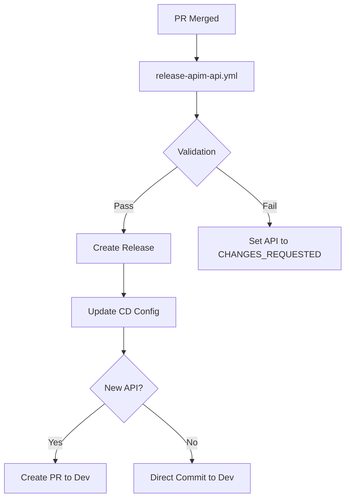
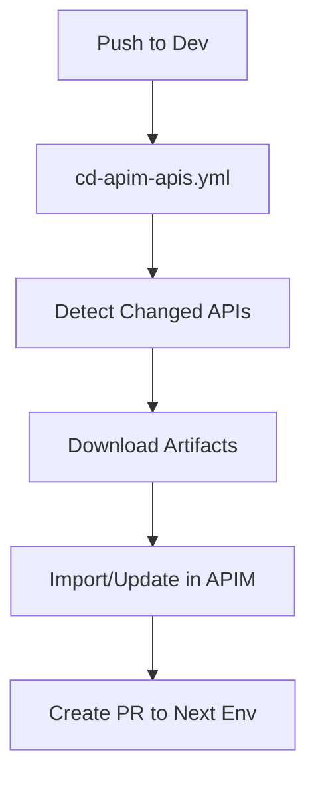
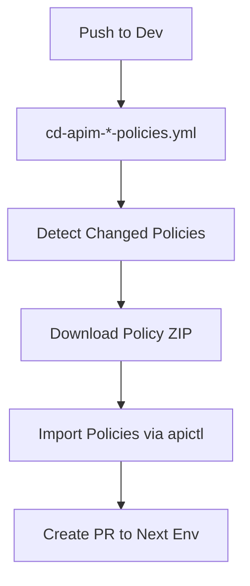

# GitHub Workflows Documentation

This repository contains reusable GitHub Actions workflows for WSO2 API Manager (APIM) CI/CD pipeline operations. These workflows automate the deployment, validation, and release management of APIs and policies.

## Table of Contents

- [Overview](#overview)
- [Workflow Categories](#workflow-categories)
  - [API Workflows](#api-workflows)
  - [Policy Workflows](#policy-workflows)
  - [Validation Workflows](#validation-workflows)
- [Workflow Details](#workflow-details)
- [Common Patterns](#common-patterns)
- [Prerequisites](#prerequisites)

## Overview

The workflows implement a GitOps-based CI/CD pipeline for WSO2 APIM, supporting:

- **Automated validation** using Spectral rulesets and apictl
- **Release management** with GitHub Releases
- **Multi-environment deployments** (Dev, Staging, Production)
- **Policy management** for mediation and rate-limiting policies
- **Automated PR creation** for environment promotion

## Workflow Categories

### API Workflows

Workflows for managing API lifecycle, deployment, and releases.

| Workflow | File | Purpose |
|----------|------|---------|
| Release APIM API | [release-apim-api.yml](.github/workflows/release-apim-api.yml) | Validates, releases, and promotes API changes |
| Deploy APIM APIs | [cd-apim-apis.yml](.github/workflows/cd-apim-apis.yml) | Deploys APIs across environments |
| Commit API Code | [commitAPICode.yml](.github/workflows/commitAPICode.yml) | Exports and commits API configurations |

### Policy Workflows

Workflows for managing APIM policies (mediation and rate-limiting).

| Workflow | File | Purpose |
|----------|------|---------|
| Release APIM Policy | [release-apim-policy.yml](.github/workflows/release-apim-policy.yml) | Creates releases for policy repositories |
| Deploy Mediation Policies | [cd-apim-mediation-policies.yml](.github/workflows/cd-apim-mediation-policies.yml) | Deploys mediation policies across environments |
| Deploy Rate Limiting Policies | [cd-apim-rate-limiting-policies.yml](.github/workflows/cd-apim-rate-limiting-policies.yml) | Deploys rate-limiting policies across environments |

### Validation Workflows

Workflows for validating API specifications and configurations.

| Workflow | File | Purpose |
|----------|------|---------|
| Validate Properties (Spectral) | [validate-properties-spectral.yml](.github/workflows/validate-properties-spectral.yml) | Validates API properties using Spectral |
| Validate Security (Spectral) | [validate-security-spectral.yml](.github/workflows/validate-security-spectral.yml) | Validates API security configurations |
| Validate Compliance (apictl) | [validate-compliance-apictl.yml](.github/workflows/validate-compliance-apictl.yml) | Validates API compliance using WSO2 apictl |
| Extract & Validate Properties | [validate-properties.yml](.github/workflows/validate-properties.yml) | Extracts and validates custom API properties |

---

## Workflow Details

### 1. Release APIM API
**File**: [release-apim-api.yml](.github/workflows/release-apim-api.yml)

**Trigger**: `workflow_call`

**Purpose**: Main workflow for validating and releasing API changes to the CD pipeline.

**Inputs**:
- `changed_file` (string, required): Path to the API ZIP file

**Jobs**:
1. **validate-properties**: Validates API properties using Spectral
2. **validate-security**: Validates API security configuration
3. **validate-compliance**: Validates API compliance using apictl dry run mode
4. **release_apim_api**: Creates GitHub release and updates CD configuration

**Key Features**:
- Runs validation jobs in parallel
- Changes API lifecycle to `CHANGES_REQUESTED` if validation fails
- Creates incremental releases (r1, r2, r3, etc.)
- Updates centralized CD configuration in `wso2-pipeline` repository
- Automatically creates PRs for new API versions

**Environment Variables**:
- `GIT_CICD_REPO`: wso2-pipeline
- `GIT_CI_BRANCH`: main
- `GIT_CD_BRANCH`: dev

---

### 2. Deploy APIM APIs
**File**: [cd-apim-apis.yml](.github/workflows/cd-apim-apis.yml)

**Trigger**: `workflow_call`

**Purpose**: Deploys APIs to WSO2 APIM across different environments.

**Inputs**:
- `sourceBranch` (string, required): Source branch for deployment
- `destinationBranch` (string, required): Target branch for promotion
- `sourceEnv` (string, required): Source environment name
- `destinationEnv` (string, required): Destination environment name
- `apiCtlEnv` (string, required): apictl environment configuration
- `createPromotionPr` (boolean, optional): Create promotion PR (default: true)

**Secrets**:
- `ghBotPat`: GitHub bot personal access token
- `ghBotUsername`: GitHub bot username
- `ghBotEmail`: GitHub bot email

**Jobs**:
1. **detectChangedApis**: Detects API changes by monitoring `release.json` files
2. **deployApisToApim**: Deploys changed APIs using matrix strategy
3. **cleanup**: Cleans up temporary directories

**Deployment Process**:
1. Detects changes in `apim/apis/[api-name]/[version]/release.json`
2. Downloads release artifacts from GitHub Releases
3. Imports/updates API using apictl with environment-specific parameters
4. Creates promotion PR to next environment

**Key Features**:
- Sequential deployment (max-parallel: 1)
- Supports both new API import and updates with revision rotation
- Automatic cleanup of downloaded artifacts
- Environment-specific configuration via params files

---

### 3. Commit API Code
**File**: [commitAPICode.yml](.github/workflows/commitAPICode.yml)

**Trigger**: `workflow_call`

**Purpose**: Exports API from APIM and commits to Git repository.

**Inputs**:
- `apiName` (string, required): API name
- `apiVersion` (string, required): API version (e.g., 1.1.0)

**Secrets**:
- `ghBotUsername`: GitHub bot username
- `ghBotEmail`: GitHub bot email
- `ghBotPat`: GitHub bot personal access token

**Process**:
1. Normalizes API name to lowercase
2. Extracts major.minor version (e.g., 1.1.0 → v1.1)
3. Exports API as ZIP using apictl
4. Commits to repository at `apim/[version]/Artifact/`
5. Removes version suffix from ZIP filename

**Example**:
- Input: `apiName: "MyAPI"`, `apiVersion: "1.1.0"`
- Normalized: `myapi`
- Version: `v1.1`
- Path: `apim/v1.1/Artifact/MyAPI.zip`

---

### 4. Release APIM Policy
**File**: [release-apim-policy.yml](.github/workflows/release-apim-policy.yml)

**Trigger**: `workflow_call`

**Purpose**: Creates releases for policy repositories.

**Inputs**:
- `policyType` (string, required): Type of policy (mediation or rate-limiting)

**Jobs**:
1. Zips the `src` folder under repository name
2. Creates incremental GitHub release (r1, r2, r3, etc.)
3. Updates CD configuration in centralized pipeline repository
4. Creates PR for new policy repositories

**Release File Structure**:
```json
{
  "artifactRepository": "org/repo-name",
  "releaseVersion": "r1",
  "artifacts": ["repo-name.zip"],
  "pullRequest": {
    "url": "https://github.com/...",
    "title": "PR Title",
    "mergedAt": "2025-01-01T00:00:00Z"
  }
}
```

**CD Config Location**:
- `apim/policies/[policyType]/[repo-name]/release.json`

---

### 5. Deploy APIM Mediation Policies
**File**: [cd-apim-mediation-policies.yml](.github/workflows/cd-apim-mediation-policies.yml)

**Trigger**: `workflow_call`

**Purpose**: Deploys mediation policies across environments.

**Inputs**: Same as Deploy APIM APIs

**Jobs**:
1. **detectChangedPolicyRepos**: Detects changes in mediation policy `release.json`
2. **deployPoliciesToApim**: Deploys policies using apictl

**Policy Structure**:
```
repo-name/
  src/
    policy-name/
      v1/
        policy.yaml
        metadata.yaml
```

**Deployment Process**:
1. Downloads policy ZIP from GitHub Releases
2. Extracts and restructures for apictl import
3. Imports each policy version using `apictl import policy api`
4. Handles "already exists" errors gracefully
5. Creates promotion PR to next environment

**Key Features**:
- Supports multiple policies per repository
- Handles policy versioning (v1, v2, etc.)
- Sequential deployment to prevent conflicts

---

### 6. Deploy APIM Rate Limiting Policies
**File**: [cd-apim-rate-limiting-policies.yml](.github/workflows/cd-apim-rate-limiting-policies.yml)

**Trigger**: `workflow_call`

**Purpose**: Deploys rate-limiting policies across environments.

**Inputs**: Same as Deploy APIM APIs

**Jobs**: Similar to mediation policies workflow

**Deployment Differences**:
- Uses `apictl import policy rate-limiting`
- Expects YAML files directly in `src/` directory
- Imports with `--update` flag

**Policy Location**:
- `apim/policies/rate-limiting/[repo-name]/release.json`

---

### 7. Validate API Properties (Spectral)
**File**: [validate-properties-spectral.yml](.github/workflows/validate-properties-spectral.yml)

**Trigger**: `workflow_call`

**Purpose**: Validates API properties using Spectral linting.

**Inputs**:
- `zip_path` (string, required): Path to API ZIP file

**Process**:
1. Extracts `api.yaml` from ZIP
2. Installs Spectral CLI
3. Runs validation using ruleset: `wso2-rulesets/rules/propertiesValidation.yml`
4. Outputs in GitHub Actions format

**Ruleset Repository**: `wso2-rulesets`

---

### 8. Validate API Security (Spectral)
**File**: [validate-security-spectral.yml](.github/workflows/validate-security-spectral.yml)

**Trigger**: `workflow_call`

**Purpose**: Validates API security configuration using Spectral.

**Inputs**:
- `zip_path` (string, required): Path to API ZIP file

**Process**: Similar to property validation

**Ruleset**: `wso2-rulesets/rules/security-validation.yaml`

---

### 9. Validate API Compliance (apictl)
**File**: [validate-compliance-apictl.yml](.github/workflows/validate-compliance-apictl.yml)

**Trigger**: `workflow_call`

**Purpose**: Validates API compliance using WSO2 apictl dry-run.

**Inputs**:
- `zip_path` (string, required): Path to API ZIP file
- `environment` (string, required): apictl environment for validation

**Jobs**:
1. Verifies apictl availability
2. Runs `apictl import api --dry-run --format json`
3. Counts ERROR and WARN violations
4. Generates HTML compliance report
5. Uploads results as artifacts

**Validation Logic**:
- ✅ **PASS**: Zero ERROR violations (warnings allowed)
- ❌ **FAIL**: One or more ERROR violations

**Artifacts**:
- `compliance_results.json`: Raw JSON results
- `compliance_report.html`: Human-readable HTML report
- Retention: 30 days

---

### 10. Extract & Validate API Properties
**File**: [validate-properties.yml](.github/workflows/validate-properties.yml)

**Trigger**: `workflow_dispatch` or `workflow_call`

**Purpose**: Extracts and validates custom API properties using Python scripts.

**Inputs**:
- `zip_path` (string, required): Path to API ZIP file

**Process**:
1. Extracts `api.yaml` from ZIP
2. Runs `extract_api_properties.py` to extract custom properties
3. Outputs in console, JSON, and GitHub Actions format
4. Validates properties using `validate_properties.py`

**Outputs**:
- `domain`: Extracted domain property
- `owner`: Extracted owner property

**Expected Scripts**:
- `extract_api_properties.py`
- `validate_properties.py`

---

## Common Patterns

### Release Versioning

All release workflows use incremental versioning:

```bash
# Format: r[number]
# Examples: r1, r2, r3, r10, r100

# Logic:
currentVersion=$(gh release view --json tagName --jq '.tagName' || true)
if [ -z "$currentVersion" ]; then
  newVersion="r1"
else
  currentNumber=$(echo "$currentVersion" | sed 's/^r//')
  newNumber=$((currentNumber + 1))
  newVersion="r$newNumber"
fi
```

### Git Change Detection

Workflows detect changes by monitoring specific paths:

```bash
# APIs
git diff --name-only ${{github.event.before}} ${{github.sha}} \
  | grep -E '^apim/apis/[^/]+/[^/]+/release.json'

# Mediation Policies
git diff --name-only ${{github.event.before}} ${{github.sha}} \
  | grep -E '^apim/policies/mediation/[^/]+/release.json'

# Rate Limiting Policies
git diff --name-only ${{github.event.before}} ${{github.sha}} \
  | grep -E '^apim/policies/rate-limiting/[^/]+/release.json'
```

### PR Management

Due to a bug in `gh pr edit` ([cli/cli#8358](https://github.com/cli/cli/issues/8358)), workflows:
1. Check if PR exists
2. If exists, close the PR
3. Create a new PR with updated content

```bash
prExists=$(gh pr list --base $BRANCH --head $HEAD_BRANCH --state OPEN)
if [ -z "$prExists" ]; then
  gh pr create --base $BRANCH --head $HEAD_BRANCH --title "$TITLE" --body "$BODY"
else
  prNumber=$(echo "$prExists" | awk '{print $1}')
  gh pr close $prNumber
  gh pr create --base $BRANCH --head $HEAD_BRANCH --title "$TITLE" --body "$BODY"
fi
```

### Matrix Strategy

Workflows use matrix strategy for parallel processing:

```yaml
strategy:
  max-parallel: 1  # Sequential to prevent conflicts
  matrix:
    changedApi: ${{fromJson(needs.detectChangedApis.outputs.changedApis)}}
```

### Working Directory Management

Workflows create unique temporary directories:

```yaml
env:
  WORK_DIR: /tmp/workflow-${{ github.run_id }}-${{ github.run_number }}

# Always cleanup in final job
cleanup:
  if: always()
  steps:
    - run: rm -rf ${{ env.WORK_DIR }}
```

---

## Prerequisites

### Self-Hosted Runner Requirements

- **apictl**: WSO2 APIM CLI tool (configured with environments)
- **jq**: JSON processor
- **yq**: YAML processor
- **gh**: GitHub CLI
- **Node.js 18+**: For Spectral validation
- **Python 3.x**: For property extraction/validation
- **Git**: Version control

### Required Secrets

| Secret | Purpose |
|--------|---------|
| `WSO2_GIT_BOT_USERNAME` | GitHub bot username for automation |
| `WSO2_GIT_BOT_EMAIL` | GitHub bot email |
| `WSO2_GIT_BOT_PAT` | GitHub bot personal access token |
| `WSO2_APIM_BASE_URL` | WSO2 APIM base URL |
| `WSO2_APIM_ADMIN_USERNAME` | APIM admin username |
| `WSO2_APIM_ADMIN_PASSWORD` | APIM admin password |
| `GITHUB_TOKEN` | Auto-provided by GitHub Actions |

### Required Repositories

- **wso2-pipeline**: Centralized CD configuration repository
- **wso2-rulesets**: Spectral rulesets for validation
- **API repositories**: Individual repositories per API
- **Policy repositories**: Individual repositories per policy

### Directory Structure

#### Pipeline Repository (wso2-pipeline)
```
wso2-pipeline/
├── apim/
│   ├── apis/
│   │   └── [api-name]/
│   │       └── [version]/
│   │           └── release.json
│   └── policies/
│       ├── mediation/
│       │   └── [policy-name]/
│       │       └── release.json
│       └── rate-limiting/
│           └── [policy-name]/
│               └── release.json
```

#### API Repository
```
api-name/
└── apim/
    └── [version]/
        ├── Artifact/
        │   └── api-name.zip
        └── Conf/
            └── env-params.yaml
```

#### Policy Repository
```
policy-name/
└── src/
    └── [policy]/
        └── [version]/
            ├── policy.yaml
            └── metadata.yaml
```

---

## Workflow Execution Flow

### API Release Flow



### API Deployment Flow



### Policy Deployment Flow



---

## Best Practices

1. **Semantic Versioning**: Use semantic versioning for APIs (1.0.0, 1.1.0, etc.)
2. **Environment Isolation**: Maintain separate branches for each environment
3. **Sequential Deployment**: Use `max-parallel: 1` to prevent race conditions
4. **Artifact Cleanup**: Always clean up temporary files and directories
5. **Error Handling**: Handle "already exists" errors gracefully
6. **Validation First**: Run all validations before creating releases
7. **Audit Trail**: Include PR metadata in releases for traceability

---

## Troubleshooting

### Common Issues

**Issue**: `apictl: command not found`
- **Solution**: Install apictl on self-hosted runner and add to PATH

**Issue**: Validation fails with "No violations found" but workflow fails
- **Solution**: Check compliance report for detailed error messages

**Issue**: PR creation fails
- **Solution**: Verify GitHub bot PAT has correct permissions (repo, workflow)

**Issue**: API import fails with "already exists"
- **Solution**: Workflow should handle this automatically; check logs

**Issue**: Policy import fails
- **Solution**: Verify policy structure matches expected format

---

## Contributing

When adding new workflows:
1. Follow the reusable workflow pattern (`workflow_call`)
2. Document all inputs, outputs, and secrets
3. Include error handling and cleanup steps
4. Use consistent naming conventions
5. Add to this documentation

---

## References

- [WSO2 APIM Documentation](https://apim.docs.wso2.com/)
- [GitHub Actions Documentation](https://docs.github.com/en/actions)
- [Spectral Documentation](https://stoplight.io/open-source/spectral)
- [GitHub CLI Issue #8358](https://github.com/cli/cli/issues/8358)
